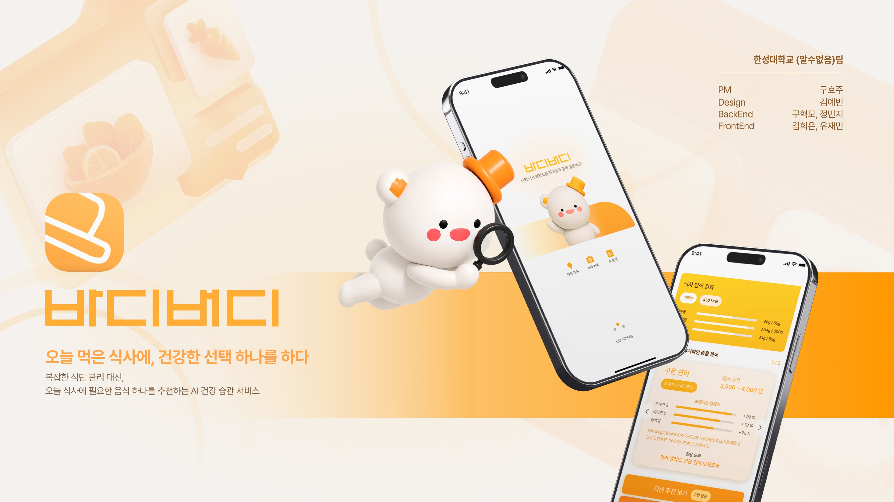
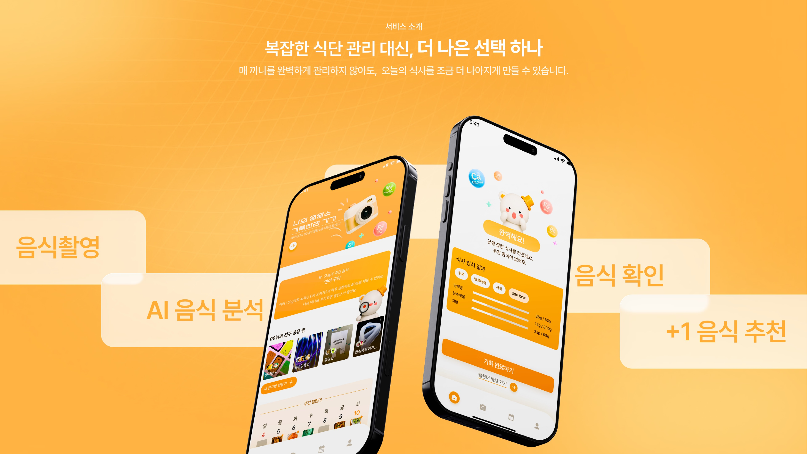
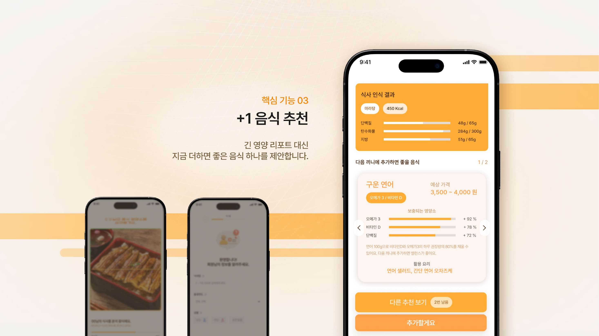
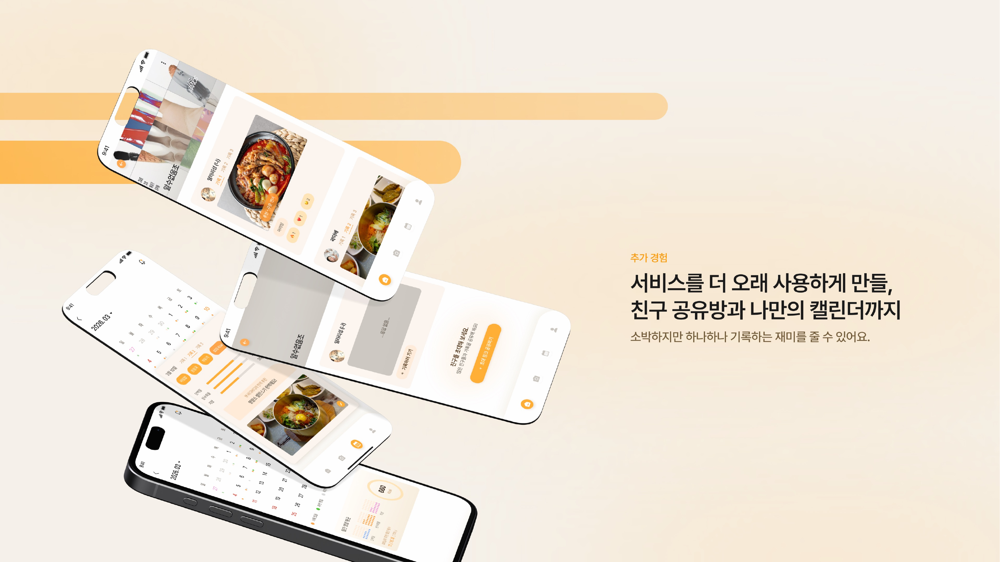

<p align="center">
  
</p>

<h1 align="center">바디버디</h1>

<p align="center">
  <strong>오늘 먹은 식사에, 더 나은 선택 하나.</strong>
</p>

<p align="center">
  사진 한 장 또는 짧은 설명으로 식사를 기록하면 AI가 영양 상태를 분석하고,<br />
  지금 더하면 좋은 <strong>+1 음식</strong>을 제안하는 건강 습관 서비스입니다.
</p>

<p align="center">
  <a href="https://bodybuddy-ms14.vercel.app"><strong>Live Demo</strong></a>
  &nbsp;·&nbsp;
  <a href="https://github.com/HSU-Likelion14-Unknown/BodyBuddy-FE">Frontend</a>
  &nbsp;·&nbsp;
  <a href="https://github.com/HSU-Likelion14-Unknown/BodyBuddy-BE">Backend</a>
</p>

## 한 장의 기록이, 오늘의 +1이 되기까지

<p align="center">
  
</p>

<p align="center">
  <strong>음식 기록</strong> → <strong>AI 인식</strong> →
  <strong>결과 확인</strong> → <strong>+1 음식 선택</strong>
</p>

바디버디는 긴 영양 리포트를 건네고 판단을 맡기지 않습니다. 오늘의 식사에서
가장 부족한 부분을 찾고, 바로 실천할 수 있는 음식 하나까지 연결합니다.

## 사용자에게 직접 물었습니다

건강한 식사의 필요성은 알지만, 무엇을 더 먹어야 할지 판단하는 일은 여전히
어렵습니다. 바디버디는 20대 청년 129명의 목소리에서 이 문제와 서비스 가능성을
확인했습니다.

<table>
  <tr>
    <td align="center" width="33%">
      <strong>60.5%</strong><br />
      식사 시 영양 균형을<br />고려하기 어렵다
    </td>
    <td align="center" width="33%">
      <strong>52.7%</strong><br />
      건강하게 먹기 위해 무엇을 선택할지<br />고민되거나 어렵다
    </td>
    <td align="center" width="33%">
      <strong>79.1%</strong><br />
      AI 분석·보완 음식 추천 서비스를<br />이용할 의향이 있다
    </td>
  </tr>
</table>

<p align="center">
  <sub>자체 설문 · 2026.08.15–16 · n=129</sub>
</p>

## 주요 기능

### 🌱 가입 없이, 내 조건부터

- 별도의 계정 생성 없이 익명 세션으로 바로 시작합니다.
- 닉네임·출생연도·성별과 함께 알레르기·비선호 음식을 등록합니다.
- 서버에는 원본 접근 키 대신 해시를 저장하고, 중복 요청은 멱등성 키로 방지합니다.

### 📸 찍거나 적는 식사 기록

- 카메라 촬영, 갤러리 이미지, 짧은 문장 중 편한 방식으로 식사를 남깁니다.
- AI가 사진 속 음식을 비동기로 인식하고 식품 데이터와 연결합니다.
- 인식된 음식에서 빠진 항목은 추가하고 잘못된 항목은 삭제한 뒤 확정합니다.
- 음식이 아니거나 인식 신뢰도가 낮으면 다시 촬영하거나 직접 입력할 수 있습니다.

### 🥕 숫자에서 끝나지 않는 +1 추천

- 당일 식사와 연령·성별 기준 섭취량을 비교해 가장 부족한 영양소를 찾습니다.
- 국가표준식품성분 데이터를 바탕으로 부족분을 채울 원재료와 활용 메뉴를 제안합니다.
- 알레르기와 비선호 음식은 원재료와 메뉴 후보에서 다시 걸러냅니다.
- 추천을 선택하거나 건너뛰고 다른 후보를 볼 수 있으며, 이미 균형이 충분하면
  억지로 음식을 추천하지 않습니다.

<p align="center">
  
</p>

### 🗓️ 추천이 습관으로 남는 식사 캘린더

- 날짜별 식사 사진·음식 목록·영양 정보를 다시 확인합니다.
- 월별 기록 일수와 칼로리·탄수화물·단백질·지방의 일평균을 돌아봅니다.
- 추천 후 24시간 안의 다음 식사에 추천 음식이 포함됐는지 확인해 실천 여부를
  구분합니다.

### 🤝 오늘의 한 끼를 나누는 친구방

- 공유방을 만들고 초대 링크로 친구를 간편하게 초대합니다.
- 친구들의 오늘 식사를 한 피드에서 확인하고 이모지로 반응합니다.
- 공유 여부와 방 커버를 직접 관리하며 함께 기록하는 분위기를 만듭니다.

<p align="center">
  
</p>

## 추천은 이렇게 만들어집니다

바디버디의 추천은 생성형 AI의 한 번의 답변에만 의존하지 않습니다.

<p align="center">
  <strong>식품 데이터 3,366개 · 추천 원재료 후보 672개 · 분석 영양소 7종</strong>
</p>

1. 확정된 식사의 영양소를 합산합니다.
2. `2025 한국인 영양소 섭취기준`과 비교해 단백질·식이섬유·칼슘·철·칼륨·
   비타민 A·비타민 C 가운데 부족 비율이 가장 큰 영양소를 찾습니다.
3. `국가표준식품성분 DB 10.4`에서 보완 효과가 큰 원재료를 먼저 순위화합니다.
4. 알레르기·비선호 음식과 이미 노출된 후보를 제외하고 조건에 맞는 활용 메뉴를
   연결합니다.
5. 데이터만으로 후보나 메뉴가 부족할 때 OpenAI가 빈자리를 보완하고, 같은 개인 조건
   필터를 다시 통과시킵니다.

균형 계산과 후보 선별은 기준 데이터가 맡고, AI는 음식 인식·미등록 음식의 영양 추정·
후보 보완처럼 필요한 구간에 집중하는 하이브리드 구조입니다.

## 시스템 구성

```text
👤 사용자
   │  사진 · 갤러리 · 짧은 설명
   ▼
📱 BodyBuddy Client (React 19 · Vite · Vercel)
   │  식사 기록 · 결과 확인 · 캘린더 · 친구방
   │  Access Key · Idempotency-Key
   │  HTTPS API
   ▼
🧠 BodyBuddy API (Spring Boot 4 · Java 21 · Docker on Gabia)
   │
   ├─▶ 🗄️ MySQL
   │      사용자 · 식사 · 영양 · 추천 · 공유방 · 반응
   ├─▶ 🖼️ Server File Storage
   │      식사 · 프로필 · 공유방 이미지
   ├─▶ 🧮 Recommendation Engine
   │      KDRI 부족분 계산 · 식품 후보 랭킹 · 개인 조건 필터
   └─⇄ 🤖 OpenAI API
          음식 인식 · 미등록 음식 영양 추정 · 후보와 메뉴 보완

📚 국가표준식품성분 DB 10.4 ── 정제·적재 ──▶ MySQL
📐 2025 한국인 영양소 섭취기준 ───────────▶ Recommendation Engine
```

음식 인식은 요청을 먼저 접수한 뒤 별도 작업에서 처리하고, 클라이언트가 상태를
확인하는 비동기 흐름으로 구성했습니다. 추천 엔진은 데이터베이스 후보를 우선 사용하며,
AI가 보완한 후보에도 알레르기·비선호 검증을 다시 적용합니다.

> [!NOTE]
> 바디버디는 일상적인 식습관 관리를 돕는 서비스이며 의료 진단이나 치료를 대체하지
> 않습니다. 알레르기 필터 결과도 최종 확인이 필요합니다.

## 기술 스택

| 영역          | 기술                                                                |
| ------------- | ------------------------------------------------------------------- |
| **Frontend**  | React 19 · Vite 8 · React Router 7 · Axios · SCSS Modules · PWA     |
| **Backend**   | Java 21 · Spring Boot 4 · Spring Data JPA · MySQL                   |
| **AI · Data** | OpenAI API · 국가표준식품성분 DB 10.4 · 2025 한국인 영양소 섭취기준 |
| **Contract**  | OpenAPI                                                             |
| **Deploy**    | Vercel · Docker · GitHub Actions · Gabia                            |

## 👥 팀 구성

<table>
  <tr>
    <td align="center" valign="bottom" width="180"><b>구효주</b></td>
    <td align="center" valign="bottom" width="180"><b>김예빈</b></td>
    <td align="center" width="180"><a href="https://github.com/huieunkim-dev"><br /><b>김희은</b></a></td>
    <td align="center" width="180"><a href="https://github.com/9hkmo"><br /><b>구혁모</b></a></td>
    <td align="center" width="180"><a href="https://github.com/jmyoo0512"><br /><b>유재민</b></a></td>
    <td align="center" width="180"><a href="https://github.com/mint0326"><br /><b>정민지</b></a></td>
  </tr>
  <tr>
    <td align="center">PM</td>
    <td align="center">Design</td>
    <td align="center">Frontend</td>
    <td align="center">Frontend</td>
    <td align="center">Backend</td>
    <td align="center">Backend</td>
  </tr>
</table>

<p align="center">
  <strong>완벽한 식단보다, 오늘의 작은 +1부터.</strong>
</p>
